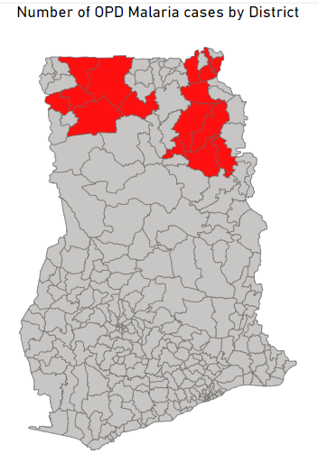

# Welcome to Milton's Portfolio 
Milton is a dynamic and results-oriented Data Specialist with over 5 years of experience in Monitoring, Learning, and Evaluation, data management systems implementation, and data analysis within the development sector. 

## Technical Proficiencies
#### Programming Languages
Python, SQL, R
#### Tools & Platforms
Excel, Stata, SPSS, Access, Google Sheets, Jupyter Notebook, Looker, Tableau, Power BI, Linux, DHIS2, ODK, CommCare Kobo Toolbox, LHIMS, and PowerPoint.
Core Competencies: Data Analysis, Project Coordination, Monitoring, Evaluation, and Learning, Digital Health, Data Visualization, and Research.
## Education
Public Health Informatics

## Work Experience
### Learning and Data Specialist
#### *2018 - Present*
**[LinkedIn](https://www.linkedin.com/in/milton-henschel/)**

# Projects
## 1. Analysis of determinants and correlates of hypertension
The study aimed to determine the risk factors of hypertension. It also answers the association between demographic variables and hypertension.
Data was imported into R studio, packages such as tidyverse, summarytools, ggplot, and etcetera were used for data cleaning, and analysis.
Below are some presentations of results.

## 2. Prevalence of congenital heart diseases (CHD) in the population-based studies and the hospital-based studies
The study involved the determination of the prevalence and pattern of CHDs in a population and hospital-based setting. Meta-analysis was conducted to identify statistical significance with studies that have conflicting results. To develop a more correct estimate of effect magnitude. 

## 3. Power BI Skillset
This section shows dashboards designed using MS Power BI.

## 4. ODK XLS Form Development for Neonatal Admission Proforma Study 
I led the design and deployment of electronic data collection tools for clinical research leveraging on ODK server.
**[A link to the XLS form used for this study](https://docs.google.com/spreadsheets/d/1yqK-CSz6mz5PmnI3Ib46dz1Vnb2j17Xj/edit?usp=sharing&ouid=103805631759623650249&rtpof=true&sd=true)**

## 5. DHIS2 Customization
The purpose of the project was to create an aggregate data collection tool for health data.
Relevant metadata such as organization units, data elements, and category combinations were created to produce the desired results.
**[Overview of assignment](https://www.linkedin.com/in/milton-henschel/overlay/1706009628448/single-media-viewer?type=DOCUMENT&profileId=ACoAAC4UkjkBp9XSoAN2RlpL1NQdI-S2q5WUto0&lipi=urn%3Ali%3Apage%3Ad_flagship3_profile_view_base%3BwJ2fk9e2QvmUcWKgl1OJUg%3D%3D)**

## 6. Developed and Configured Electronic Health Records System on EPI Info
After completing my internship at Ghana Health Service in 2019, I realized a particular need in the district I served. There was a need for an electronic health record system to handle patient data. As a health information officer, I started looking for ways to help them out. I reviewed how effectively I could use Epi Info to help them. I learned that to have a good EHR, whatever option set or parameter I use should meet the objective. I took the patient folder and developed an EHR using Epi Info. Later on, I targeted one facility in the best performing sub-district, installed the software on their laptop, added the prj file, and left for Cape Coast.
It has reduced the cost of purchasing hard copies for paper records keeping as well as reduced patient stay or waiting hours during health care. 
**[Just watch this short video about the project ](https://www.linkedin.com/feed/update/urn:li:activity:6933176829847482368/)**

## 7. The Implementation of The Amended Act 525 (2019) And Functioning of Teaching Hospital Boards in Ghana: A Survey Approach
The study examined the post-implementation of the amended Act 525, the change in structure in terms of the composition of teaching hospital boards and assessed the change in level functioning (if any) as well as to determine whether there is any association between key compositional factors the functioning of teaching hospital boards.

## 8. Factors Influencing High Prevalence of Multi-Drug Resistance TB 
The purpose of the study was to determine the factors influencing the high prevalence of multi-drug resistance TB in Cape Coast Teaching Hospital. The project was deployed on KoboToolbox and data was imported to STATA for data analysis.

## 9. The Role of Social Support in Mitigating Academic Stress of Some Second Cycle School Students 
The main objective of the study is to assess the role of social support in mitigating the academic stress of second-cycle school students.

## 10. Prevalence and Correlates of Stillbirths 
This study seeks to find out the prevalence of stillbirths recorded in the period and if the causes can be attributed to low socio-economic status, number of antenatal visits, and maternal or fetal conditions. I directly managed and analyzed the data for this project.
The data collected will be analyzed using Jamovi. Descriptive statistics using measures of frequency and central tendency will be done, as well as inferential statistics to draw out associations by testing hypothesis using chi-square test and t-test where applicable.
Attached are the findings.

## 11. Assessment of Nurses' Personal Counseling Competencies in Bereavement Care 
The main objective of the study was to assess nurse’s competencies in bereavement and to identify their training needs.
Data was analyzed using SPSS version 20 and presented as descriptive and inferential statistics. Analyzing the data was linear and its validity was constantly checked throughout the study by referring back to the raw data.
Results as attached

